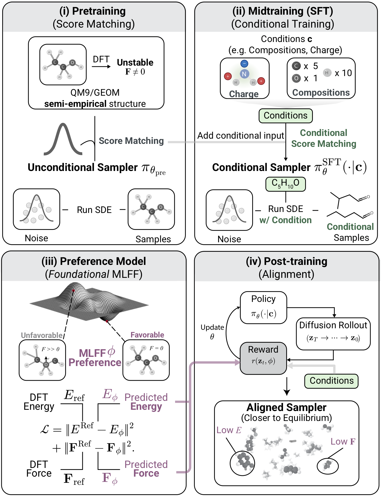
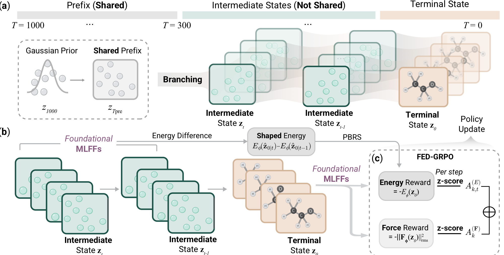

<div align="center">

# ELIGN

**Equivariant Diffusion Alignment with Foundational ML Force Fields**

[Paper](https://arxiv.org/abs/2601.21985) • [Documentation](docs/) • [Quick start](#quick-start) • [Citation](#citation)

[](LICENSE)
[](#installation)

</div>

ELIGN is a post-training method for **E(3)-equivariant diffusion models** for 3D molecule generation. Starting from a pretrained diffusion backbone (EDM-style), ELIGN optimizes the **reverse-diffusion policy** with reinforcement learning using physics-inspired rewards (e.g., energies and forces from foundational ML force fields).

The RL optimizer used in ELIGN is **FED-GRPO** (**F**orce and **E**nergy **D**isentangled **G**roup **R**elative **P**olicy **O**ptimization), which:

- samples **groups** of rollouts per prompt and normalizes rewards *within each group*
- computes force and (optional) energy rewards from an ML force field
- builds **group-relative advantages** with disentangled force/energy channels mixed via configurable weights
- updates the diffusion policy with a **clipped policy-gradient objective** (PPO-style) and optional KL-to-reference regularization

This repository contains:

- `edm_source/`: equivariant diffusion backbone (training + MLFF-guided sampling utilities)
- `elign/`: ELIGN post-training stack (rollout, reward, filtering, FED-GRPO trainer/actor)

## Method overview

<p align="center">
  
</p>
<p align="center">
  <em>Figure 1. High-level ELIGN pipeline: pretraining (score matching), conditional midtraining, foundational MLFF as a preference model, and RL post-training (alignment).</em>
</p>

<p align="center">
  
</p>
<p align="center">
  <em>Figure 2. FED-GRPO overview: grouped diffusion rollouts with optional shared prefix, energy shaping (PBRS), and force/energy advantage normalization.</em>
</p>

## Contents

- [Installation](#installation)
- [Quick start](#quick-start)
- [Repository layout](#repository-layout)
- [Documentation](#documentation)
- [Citation](#citation)
- [License](#license)

## Installation

### 1) Create an environment

Recommended (conda):

```bash
conda create -n elign python=3.10 -c conda-forge rdkit
conda activate elign
pip install -r requirements.txt
```

Notes:
- RDKit is easiest to install via conda. If you use pip, ensure an RDKit wheel exists for your platform.
- GPU support depends on your PyTorch install; follow the official PyTorch instructions for your CUDA version.

### 2) (Optional) Install an ML force field backend (UMA via FAIRChem)

ELIGN’s default reward (`UMAForceReward`) expects `fairchem`:

- Code path: `edm_source/mlff_modules/mlff_utils.py` imports `fairchem.core.pretrained_mlip`.

Install a compatible FAIRChem package (or build from source) and ensure you can load the UMA predictor in Python.

### 3) (Optional) Hugging Face access

If your MLFF weights require authentication, use one of:

```bash
huggingface-cli login
# or
export HF_TOKEN=...
```

## Quick start

### A) Train the diffusion backbone (EDM-style)

QM9 example (from repo root):

```bash
python edm_source/main_qm9.py \
  --exp_name edm_qm9 \
  --n_epochs 3000 \
  --diffusion_steps 1000
```

GEOM-Drugs example:

```bash
python edm_source/main_geom_drugs.py \
  --exp_name edm_geom_drugs \
  --n_epochs 3000 \
  --diffusion_steps 1000
```

See `edm_source/README.md` for more details on the backbone code.

### B) Post-train with ELIGN (FED-GRPO)

ELIGN post-training is configured with Hydra YAMLs under `elign/trainer/config/`.

Minimal smoke test (no MLFF required):

```bash
python run_elign.py \
  --config-name fed_grpo_config \
  reward.type=dummy \
  wandb.enabled=false \
  dataloader.epoches=2 \
  dataloader.sample_group_size=2 \
  dataloader.each_prompt_sample=4 \
  model.time_step=50
```

QM9 post-training with UMA rewards (requires FAIRChem/UMA):

```bash
torchrun --standalone --nproc_per_node=1 run_elign.py \
  --config-name fed_grpo_qm9_energy_force_group4x6 \
  save_path=outputs/elign/qm9/my_run \
  wandb.enabled=false
```

Paper-aligned QM9 config (PBRS return-to-go):

```bash
torchrun --standalone --nproc_per_node=1 run_elign.py \
  --config-name fed_grpo_qm9_paper_pbrs \
  save_path=outputs/elign/qm9/paper_pbrs \
  wandb.enabled=false
```

### C) Evaluate a post-trained checkpoint

1) Sample rollouts:

```bash
python eval_elign_rollout.py \
  --run-dir outputs/elign/qm9/my_run \
  --num-molecules 1024 \
  --output outputs/elign/qm9/my_run/eval_rollouts.pt
```

2) Compute metrics (RDKit + stability + optional MLFF forces/energies):

```bash
python compute_elign_metrics.py \
  --run-dir outputs/elign/qm9/my_run \
  --samples outputs/elign/qm9/my_run/eval_rollouts.pt \
  --output outputs/elign/qm9/my_run/eval_metrics.json
```

## Repository layout

```
.
├── edm_source/                 # Equivariant diffusion backbone (EDM-style)
│   ├── equivariant_diffusion/  # Diffusion model + samplers
│   ├── egnn/                   # EGNN layers
│   ├── qm9/                    # QM9 dataset + metrics
│   └── mlff_modules/           # MLFF guidance utilities
├── elign/                      # ELIGN post-training stack
│   ├── dataloader/             # Grouped rollout batch construction
│   ├── model/                  # EDM wrapper helpers (policy logprob, masks, ...)
│   ├── trainer/                # FED-GRPO trainer + Hydra configs
│   ├── worker/                 # rollout / reward / actor / filters
│   └── utils/                  # RDKit metrics + tensor utilities
├── pretrained/                 # Example pretrained EDM weights (optional)
├── docs/                       # Extended documentation
├── run_elign.py                # ELIGN + FED-GRPO entrypoint (Hydra)
├── eval_elign_rollout.py       # Generate samples from a trained ELIGN policy
└── compute_elign_metrics.py    # Compute metrics over sampled rollouts
```

## Documentation

Start here:

- `docs/installation.md`
- `docs/elign_posttraining.md`
- `docs/fed_grpo.md`
- `docs/paper_code_map.md`
- `docs/evaluation.md`
- `docs/config_reference.md`

Backbone docs (upstream EDM-style code):

- `edm_source/README.md`
- `edm_source/README_MLFF_GUIDANCE.md`

## Citation

If you use ELIGN/FED-GRPO in your work, please cite:

```bibtex
@misc{li2026elignequivariantdiffusionmodel,
      title={Elign: Equivariant Diffusion Model Alignment from Foundational Machine Learning Force Fields},
      author={Yunyang Li and Lin Huang and Luojia Xia and Wenhe Zhang and Mark Gerstein},
      year={2026},
      eprint={2601.21985},
      archivePrefix={arXiv},
      primaryClass={cs.LG},
      url={https://arxiv.org/abs/2601.21985},
}
```

For UMA (the default MLFF reward backend used by this repo), please cite:

```bibtex
@inproceedings{
wood2025uma,
title={{UMA}: A Family of Universal Models for Atoms},
author={Brandon M Wood and Misko Dzamba and Xiang Fu and Meng Gao and Muhammed Shuaibi and Luis Barroso-Luque and Kareem Abdelmaqsoud and Vahe Gharakhanyan and John R. Kitchin and Daniel S. Levine and Kyle Michel and Anuroop Sriram and Taco Cohen and Abhishek Das and Sushree Jagriti Sahoo and Ammar Rizvi and Zachary Ward Ulissi and C. Lawrence Zitnick},
booktitle={The Thirty-ninth Annual Conference on Neural Information Processing Systems},
year={2025},
url={https://openreview.net/forum?id=SvopaNxYWt}
}
```

Also cite the upstream EDM / E(3)-diffusion work (see `edm_source/LICENSE`, `edm_source/README.md`, and `edm_source/README_MLFF_GUIDANCE.md`).

A `CITATION.cff` file is provided in the repo root.

## License

- ELIGN post-training code (`elign/`) is released under Apache-2.0 (see `LICENSE`).
- The diffusion backbone under `edm_source/` includes MIT-licensed components (see `edm_source/LICENSE`).
